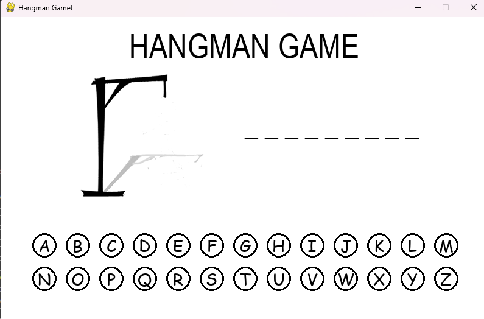
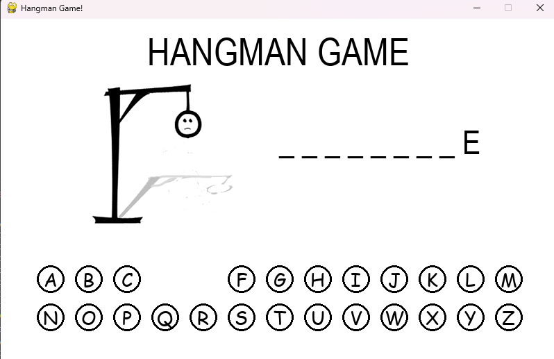
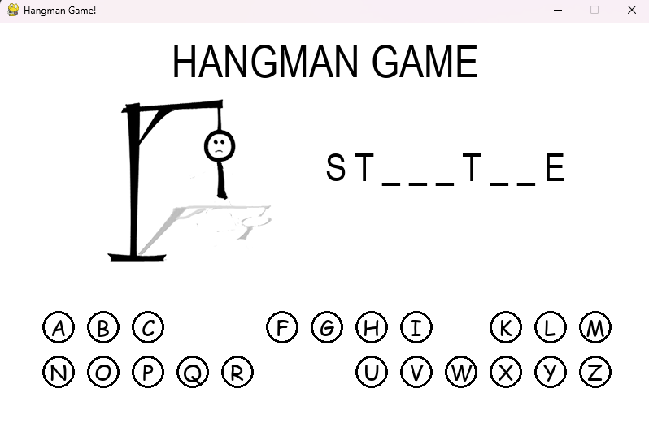
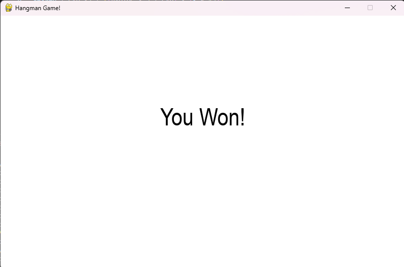

# Hangman Game with Python and Pygame

Welcome to the Hangman Game project! This is a classic Hangman game implemented in Python using the Pygame library. It's a fun and interactive way to test your word-guessing skills while also serving as a great example of a simple game development project using Pygame.

## Features

- **Classic Hangman Gameplay:** Guess the letters of a hidden word before the hangman is fully drawn.
- **Interactive Graphics:** Enjoy a visually appealing interface created with Pygame.
- **Random Word Selection:** A list of words from which a new word is chosen randomly each time you play.
- **User-friendly Interface:** Simple and intuitive controls make it easy for anyone to play.

## Installation

To run this project locally, follow these steps:

1. **Clone the Repository:**

 ```bash
   git clone https://github.com/AkaDeepanshu/Hangman_Game.git
   cd Hangman_Game
  ```

2. **Install Dependencies:**

Make sure you have Python and Pygame installed. You can install Pygame using pip:

```bash
pip install pygame
```

3. **Run the Game:**

```bash
python hangman.py
```

## How to Play

1. **Start the Game:** Run the `hangman.py` file.
  ```bash
   python hangman.py
  ```

2. **Guess the Word:** Enter letters to guess the hidden word. You have a limited number of incorrect guesses before the hangman is fully drawn.
   
3. **Win or Lose:** Try to guess the word before the hangman is complete to win the game.

    
## Screenshots
<div>
 <h3>1. Game Start Screen</h3>

 <h3>2. Game Play Screen</h3>
<br>

 </div>
 <h3>3. Game Over Screen</h3>

</div>

## Contributing
Contributions are welcome! Feel free to create a pull request or open an issue if you have any suggestions or improvements.


## Acknowledgements
This project was developed using the Pygame library.
Special thanks to all the contributors and open-source projects that made this possible.
